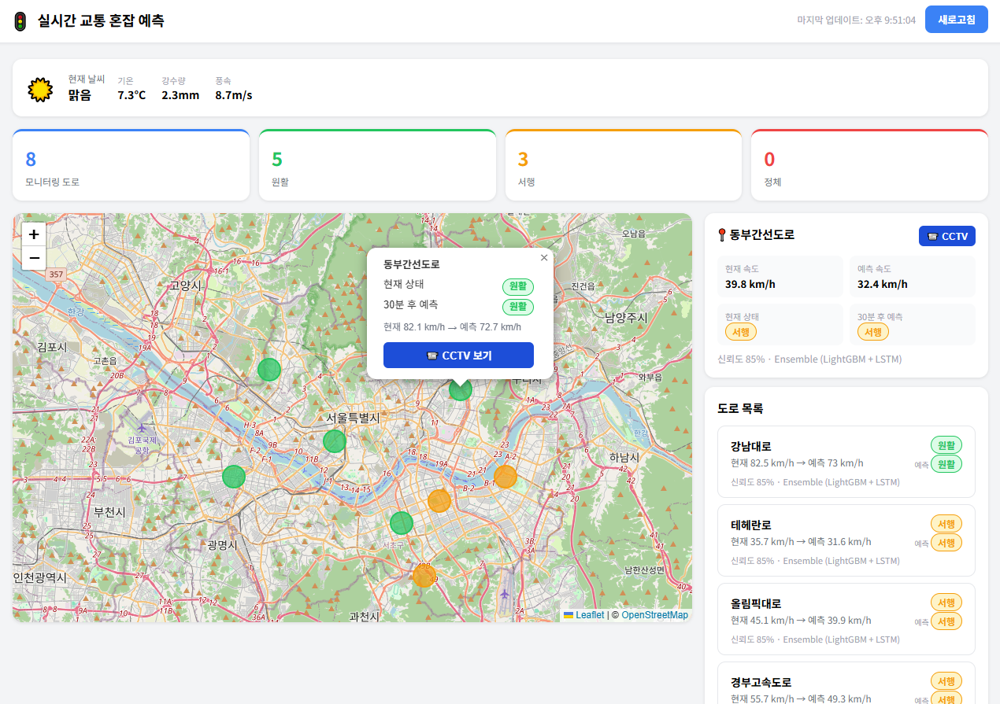
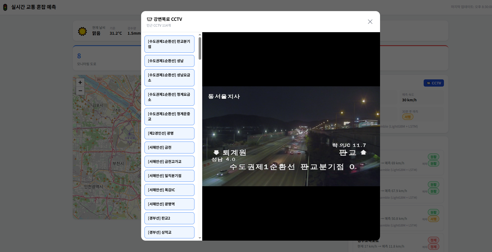

# 실시간 교통 혼잡 예측 시스템

교통 데이터와 기상 데이터를 융합하여 AI(LightGBM + LSTM)로 도로 혼잡도를 예측하고, 고속도로 CCTV 실시간 영상을 제공하는 웹 애플리케이션입니다.





---

## 기술 스택

| 구분 | 기술 |
|------|------|
| Frontend | React 19, Vite 5, Leaflet, HLS.js |
| Backend | FastAPI, Uvicorn |
| AI 모델 | LightGBM + LSTM 앙상블 |
| 데이터 | 국가교통정보센터 API, 기상청 API, 고속도로 CCTV API |

---

## 프로젝트 구조

```
source/
├── backend/
│   ├── app.py                        # 서버 실행 진입점
│   ├── requirements.txt
│   ├── .env.example                  # 환경변수 예시
│   ├── logs/                         # 날짜별 로그 (자동 생성)
│   ├── config/
│   │   ├── settings.py               # 환경변수 키 매핑 (prop)
│   │   ├── logger.py                 # 로그 설정 (날짜별 롤링)
│   │   └── __init__.py
│   └── app/
│       ├── web/
│       │   ├── api.py                # FastAPI 앱, 미들웨어, 라우터 등록
│       │   └── token_header.py       # X-Token 헤더 인증
│       ├── routers/
│       │   ├── traffic.py            # 실시간 교통 API
│       │   ├── weather.py            # 기상 API
│       │   ├── prediction.py         # 혼잡도 예측 API
│       │   └── cctv.py               # 고속도로 CCTV API
│       ├── services/
│       │   ├── traffic_service.py    # 국가교통정보센터 데이터 수집
│       │   ├── weather_service.py    # 기상청 데이터 수집
│       │   └── cctv_service.py       # 고속도로 CCTV 데이터 수집
│       ├── models/
│       │   └── predictor.py          # LightGBM + LSTM 앙상블 모델
│       └── schemas/
│           └── traffic.py            # Pydantic 스키마
│
└── frontend/
    ├── vite.config.js
    ├── .env.example                  # 환경변수 예시
    └── src/
        ├── App.jsx
        ├── pages/
        │   └── Dashboard.jsx         # 메인 대시보드 페이지
        ├── components/
        │   ├── TrafficMap.jsx         # Leaflet 지도 (혼잡도 마커)
        │   ├── CctvModal.jsx          # CCTV 실시간 영상 모달
        │   ├── RoadList.jsx           # 도로 목록 사이드바
        │   ├── WeatherCard.jsx        # 현재 날씨 카드
        │   ├── StatsBar.jsx           # 혼잡도 통계 바
        │   └── CongestionBadge.jsx    # 원활/서행/정체 뱃지
        ├── hooks/
        │   └── useTrafficData.js      # 데이터 fetch + 자동 갱신 훅
        └── services/
            └── api.js                 # Axios 인스턴스 (X-Token 포함)
```

---

## 실행 방법

### 1. 환경변수 설정

```bash
# backend/.env.example → backend/.env 복사 후 키 입력
cp backend/.env.example backend/.env

# frontend/.env.example → frontend/.env 복사
cp frontend/.env.example frontend/.env
```

`backend/.env` 필수 항목:
```
API_TOKEN=<임의의 보안 토큰>
TRAFFIC_API_KEY=<국가교통정보센터 API 키>
WEATHER_API_KEY=<기상청 API 키>
CCTV_API_KEY=<고속도로 CCTV API 키>
```

`frontend/.env` 필수 항목:
```
VITE_API_URL=http://localhost:8000
VITE_API_TOKEN=<backend/.env의 API_TOKEN과 동일한 값>
```

### 2. 백엔드 실행

```bash
# 가상환경 활성화 (PowerShell)
.\venv\Scripts\Activate.ps1

# 의존성 설치 (최초 1회)
pip install -r backend/requirements.txt

# 서버 실행
cd backend
python app.py
```

### 3. 프론트엔드 실행

```bash
cd frontend
npm install   # 최초 1회
npm run dev
```

브라우저에서 `http://localhost:5173` 접속

---

## API 엔드포인트

모든 요청에 `X-Token` 헤더 필요

| 메서드 | 경로 | 설명 |
|--------|------|------|
| GET | `/api/traffic/realtime` | 실시간 교통 데이터 전체 |
| GET | `/api/weather/current` | 현재 기상 데이터 |
| GET | `/api/prediction/all` | 전체 도로 혼잡도 예측 |
| GET | `/api/prediction/{road_id}` | 특정 도로 혼잡도 예측 |
| GET | `/api/cctv/nearby?lat=&lng=` | 인근 고속도로 CCTV 목록 |

---

## AI 모델

- **LightGBM**: 시간대, 요일, 속도, 기상 피처 기반 예측
- **LSTM**: 과거 시계열 데이터 기반 예측
- **앙상블**: LightGBM 40% + LSTM 60% 가중 평균

API 키 미등록 시 목업 데이터로 동작합니다.
